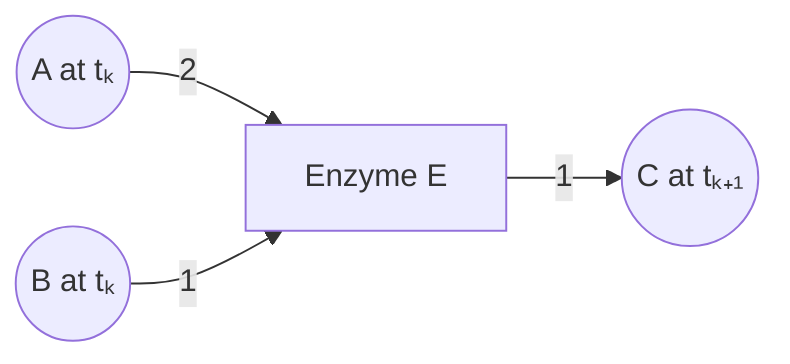

# Research idea: Time-expanded enzyme–metabolite flow networks

**Saved:** September 13, 2026  
**Purpose:** Preserve the idea and research framing for a later brainstorming session.  
**Status:** Conceptual proposal; no implementation or definitive novelty assessment yet.

## Core idea

Represent metabolism as a sequence of alternating metabolite and enzyme layers:

```text
{metabolites at t₀} → {enzymes used during the interval} → {metabolites at t₁}
                   → {enzymes used during the next interval} → {metabolites at t₂} → …
```

The intended vertices are **metabolites and enzymes**. There are no explicit
reaction vertices. Incoming edges identify substrates acted on by an enzyme;
outgoing edges identify the products of that activity. Products become available
as substrates for subsequent enzyme activity. Stoichiometric coefficients belong
on the edges.

For example, a transformation with stoichiometry $2A+B\rightarrow C$ could appear
as:



Repeated appearances of a metabolite represent its availability at different
times. Repeated appearances of an enzyme represent its use at different stages;
they do not automatically represent additional enzyme inventory.

The discussion favored using position in the sequence to distinguish successive
enzyme uses, without requiring explicit reaction labels such as $r_1$ and $r_2$.
Precisely how to represent several alternative transformations at the same enzyme
appearance remains an open modeling question.

## Research framing to preserve

The initial motivation is a **publication-oriented metabolic modeling idea**.
The central question is whether a time-expanded enzyme–metabolite representation
provides a useful way to formulate and solve metabolic production problems.

**Established time expansion, flow algorithms, solvers, and examples are benefits
of the proposal.** They provide a mature foundation, reduce implementation risk,
support verification, and make a resulting method easier to reproduce and adopt.

Do not equate the use of established OR machinery with an absence of scientific
contribution. The motivating analogy discussed was the impact of applying linear
programming to metabolism through FBA: an insightful biological formulation and
application can be consequential without inventing the underlying optimization
algorithm.

The contribution could lie in a faithful metabolic interpretation, useful
predictions, interpretable production limitations, or engineering decisions.
A new solver, new machine-learning architecture, or new chemistry is not a
prerequisite for investigating the core proposal.

A provisional description is:

> Bring mature network optimization methods to finite-horizon metabolic analysis
> through a time-expanded enzyme–metabolite representation.

## Optimization interpretations

| Problem | Proposed metabolic interpretation |
|---|---|
| Maximum flow / production | Maximize delivery of a specified product by a deadline, subject to substrate availability and enzyme capacities. |
| Minimum cost | Meet a specified product demand by a deadline while minimizing a defined resource cost. |
| Minimum-cost maximum production | Find the greatest feasible production, then minimize the cost of achieving it. |
| Earliest production / minimum completion time | Find the earliest time at which a specified amount of product can be delivered. |

Possible costs include substrate expense, enzyme-time usage, and intermediate
storage. The physical interpretation and units need to be specified. Enzyme
selection or synthesis costs may require additional decision variables.

Keep three different annotations distinct:

- **Stoichiometry:** relative amounts consumed and produced.
- **Capacity:** maximum processing over an interval, potentially related to enzyme
  abundance, catalytic capacity, and interval duration.
- **Cost:** the penalty associated with an amount of processing or resource use.

For a simple 1:1 conversion, ordinary network-flow machinery may apply directly.
General metabolic transformations require coupled edge amounts. For the example
above, an extent $q$ implies

$$
f_{A\to E}=2q,\qquad f_{B\to E}=q,\qquad f_{E\to C}=q.
$$

Unrolling time does not itself enforce these relationships. Determining which
parts retain classical flow structure, and which require additional constraints,
is part of developing the formulation.

## Relationship to FBA

The idea was also proposed as a possible **alternative to classical FBA**.
Classical FBA uses a specified stoichiometric network, steady-state internal
balances, flux bounds, and an objective to select a flux distribution.
[Orth, Thiele & Palsson, 2010](https://pmc.ncbi.nlm.nih.gov/articles/PMC3108565/)

The proposed time-expanded formulation would instead explicitly distinguish
metabolite availability at successive times. A possible accounting sketch is

$$
\mathbf{x}_{k+1}=\mathbf{x}_k+S_k\mathbf{q}_k+\mathbf{b}_k,
$$

where $\mathbf{x}_k$ contains metabolite amounts, $\mathbf{q}_k$ contains
transformation extents over the interval, and $\mathbf{b}_k$ records net external
addition or removal. This is a starting point for discussion, not a completed
model. A matrix can summarize the edge stoichiometry without introducing reaction
vertices into the graph.

Balances must be supplemented with availability and capacity constraints. For
example, in a staged model where products become usable only in the next stage,
total substrate consumption during a stage cannot exceed its starting inventory
plus feeds available before processing. An end-of-stage nonnegativity constraint
alone would not enforce that causal convention.

Potentially useful questions include whether the best steady-state-yield pathway
also delivers the most product over a finite horizon, and how limited initial
intermediates or cofactors affect pathway startup.

Existing dynamic and enzyme-constrained metabolic models are relevant comparisons.
Their existence does not establish that the proposed graph formulation has already
been developed, nor does a graph reformulation by itself establish different
predictions. Compare the actual variables, constraints, and biological questions.

## Possible extension: De novo pathway assembly

The intended meaning of de novo assembly was clarified as **predicting new
enzyme–substrate transformations as the pathway grows**, not only selecting and
ordering known transformations.

One possible extension would predict enzyme activity on available substrates,
generate the resulting products and stoichiometry, and add these possibilities
to later layers. Complete product prediction is distinct from predicting an
enzyme–substrate interaction or compatibility score.

This is a potential extension of the central time-expanded flow idea. Assess the
core formulation on its own before making learned chemistry a requirement.

## Preliminary literature findings

This was a targeted exploratory search, not a systematic priority review.
**No exact match was identified for the full proposed metabolic formulation.**
That leaves its priority unresolved; it does not establish a first-use claim.

### Directly relevant to the time-expanded flow idea

| Reference | Relevance and limits |
|---|---|
| [Veeramani & Bader, 2010: Predicting functional associations from metabolism using bi-partite network algorithms](https://link.springer.com/article/10.1186/1752-0509-4-95) | Explicit enzyme–metabolite bipartite graphs exist. This does not settle the time-expanded optimization claim. |
| [Ford & Fulkerson, 1958: Constructing Maximal Dynamic Flows from Static Flows](https://pubsonline.informs.org/doi/10.1287/opre.6.3.419) | Foundational maximum delivery over a finite time horizon; general OR precedent. |
| [Fleischer & Skutella, 2007: Quickest Flows Over Time](https://epubs.siam.org/doi/10.1137/S0097539703427215) | Explicit time-expanded networks and flow optimization, including minimum-cost variants; also discusses the computational burden of expansion. |
| [Kondili, Pantelides & Sargent, 1993: A general algorithm for short-term scheduling of batch operations—I. MILP formulation](https://www.sciencedirect.com/science/article/pii/009813549380015F) | State–task networks with materials, processing operations, discrete time, inventories, resource limits, and production economics. A close chemical-engineering comparison, not an identified exact metabolic implementation. |
| [García-Ojeda et al., 2013: Building-evacuation-route planning via time-expanded process-network synthesis](https://doi.org/10.1016/j.firesaf.2013.09.023) | Time-expanded P-graphs and minimum-cost optimization outside metabolism. |
| [Nikdel et al., 2018: A systematic approach for finding the objective function and active constraints for dynamic flux balance analysis](https://web.mit.edu/braatzgroup/Nikdel_BioprocBiosystEng_2018.pdf) | Time-discretized metabolic balances and optimization; compare mathematical assumptions with the proposed graph. |
| [Dynamic modeling of enzyme controlled metabolic networks using a receding time horizon, 2018](https://doi.org/10.1016/j.ifacol.2018.09.300) | Dynamic enzyme-cost FBA with enzyme capacity, storage, and finite prediction horizons. |

The general construction of time-expanded flow networks is established. Its
metabolic application and interpretation are the specific novelty questions.
The OR precedents are resources for developing the idea, not sufficient grounds
for dismissing its publication potential.

### References for the possible de novo extension

| Reference | Relevance |
|---|---|
| [EnzymeMap, 2023](https://pubs.rsc.org/en/Content/ArticleLanding/2023/SC/D3SC02048G) | Curated enzymatic reaction data and forward/reverse reaction prediction. |
| [EnzRank, 2023](https://doi.org/10.1016/j.ymben.2023.06.001) | Ranks enzyme candidates for potential activity on new substrates. |
| [novoStoic2.0, 2025](https://journals.plos.org/ploscompbiol/article?id=10.1371/journal.pcbi.1012516) | Integrates pathway synthesis, stoichiometry, thermodynamic evaluation, and enzyme candidate selection. |
| [MetaGEM, May 2026 preprint](https://arxiv.org/html/2605.14812v1) | Predicts enzyme–metabolite interactions, maps to reaction templates, then uses FBA and gap filling for reconstruction. |
| [Zhang & Varner, April 2026 preprint](https://arxiv.org/html/2604.13471v1) | Enzymatic templates and learned one- and two-step pathway ranking for multistep retrobiosynthesis; potentially relevant existing work to build upon or compare against. |

## Questions for the next brainstorming session

1. What is the first biological problem: finite-time product formation, pathway
   startup, enzyme allocation, or de novo assembly?
2. Does each layer represent physical time, a processing interval, or an assembly
   step? How are different conversion times handled?
3. What exactly does one enzyme appearance mean, and how are shared capacity and
   alternative transformations represented?
4. How do unused metabolites persist between layers? Explicit carryover edges
   would connect metabolite copies directly, so decide whether storage is separate
   bookkeeping or an extension of the strictly bipartite picture.
5. Which biochemical constraints admit an exact classical flow formulation, and
   which require coupled-flow, LP, or mixed-integer formulations?
6. What is the simplest example where the time-expanded view produces a useful
   insight or engineering decision?
7. Which existing metabolic and process-scheduling formulations are mathematically
   equivalent under matching assumptions, and where do they differ?
8. What evidence would establish scientific value: interpretable temporal
   bottlenecks, experimental prediction, useful design choices, computational
   advantages, or some combination?

**Suggested restart:** Write down one small, fully specified network and its
optimization problem. Establish the biological meaning of each node, edge, and
constraint before expanding the scope.
